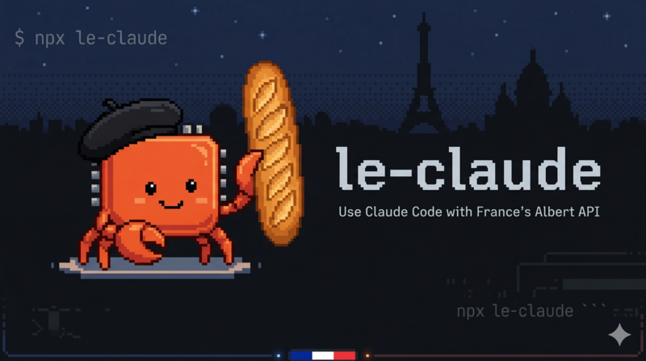

# le-claude

<p align="center">
  
</p>

[](https://www.npmjs.com/package/le-claude)
[](https://nodejs.org)
[](https://www.npmjs.com/package/le-claude?activeTab=dependencies)
[](./LICENSE)

Use [Claude Code](https://docs.anthropic.com/en/docs/claude-code) with France's [Albert API](https://albert.sites.beta.gouv.fr/) — the government-approved LLM service.

One command. Zero config after first run. Complete privacy.

```bash
npx le-claude
```

## What is this?

Claude Code is Anthropic's AI coding assistant that runs in your terminal. It normally requires an Anthropic API subscription. **le-claude** lets you use Claude Code with Albert, the French government's LLM platform operated by [DINUM/Etalab](https://www.numerique.gouv.fr/dinum/), instead.

It works by running a lightweight local translation proxy that converts between the Anthropic API format (which Claude Code speaks) and the OpenAI-compatible API format (which Albert speaks). Everything runs on your machine — no data is sent anywhere except directly to the Albert API.

## Prerequisites

1. **Node.js 22+** — required to run the proxy
2. **Claude Code** — install with:
   ```bash
   # macOS / Linux
   curl -fsSL https://claude.ai/install.sh | bash

   # or via Homebrew
   brew install --cask claude-code
   ```
   Verify with `claude --version`. See [full install docs](https://docs.anthropic.com/en/docs/claude-code).
3. **An Albert API key** — see below

## Getting an Albert API key

Albert is available to French state public servants (agents de la fonction publique d'État).

1. [Request access](https://albert.sites.beta.gouv.fr/access/) on the Albert website — you will receive your credentials by email within 24 hours
2. Once you have your credentials, log in to the [Albert playground](https://albert.playground.etalab.gouv.fr/) to generate an API key
3. Keep this key safe — you'll need it during setup

> If you're unsure about access, contact your organization's IT department or refer to the [DINUM documentation](https://www.numerique.gouv.fr/).

## Quick start

```bash
npx le-claude
```

On first run, you'll be prompted for your API key and asked to choose a model. Configuration is saved to `~/.config/le-claude/config.json` for subsequent runs.

```
$ npx le-claude

  le-claude - Use Claude Code with Albert API

  No configuration found. Let's set things up!

  Albert API Key: ****
  Testing connection... ok

  Available models:
    1. openai/gpt-oss-120b (text-generation)
  Select model [1]: 1

  Configuration saved to ~/.config/le-claude/config.json

  Starting proxy... ok (port 52341)
  Launching Claude Code...
```

Every subsequent run just works:

```bash
npx le-claude
```

### Make it a single command

Add an alias to your shell config so you can just type `le-claude`:

```bash
# Add to ~/.bashrc or ~/.zshrc:
alias le-claude="npx le-claude"
```

Then reload your shell (`source ~/.zshrc`) and from now on:

```bash
le-claude
```

Alternatively, install globally to skip npx entirely:

```bash
npm install -g le-claude
le-claude
```

## Options

```
npx le-claude [options] [-- claude-args...]

Options:
  --setup         Re-run interactive setup (change API key or model)
  --model MODEL   Override the model for this session
  --debug         Enable proxy debug logging
  -h, --help      Show help
```

Examples:

```bash
npx le-claude --debug                    # See request/response details
npx le-claude --model openai/gpt-oss-40b # Use a different model
npx le-claude --setup                    # Change API key or model
npx le-claude -- -p "Fix the bug"        # Pass arguments to Claude Code
```

## How it works

```
Claude Code  ──[Anthropic API]──▶  Local proxy (127.0.0.1)  ──[OpenAI API]──▶  Albert API
             ◀─────────────────  (translates between formats)  ◀──────────────
```

le-claude starts a translation proxy on a random localhost port, then launches Claude Code pointed at it. The proxy translates:

- **Requests**: Anthropic Messages format → OpenAI Chat Completions format
- **Responses**: OpenAI format → Anthropic format (including streaming SSE)
- **Tool use**: Full bidirectional translation of tool definitions and tool calls

When Claude Code exits, the proxy stops automatically.

## Security

- **Localhost only** — the proxy binds to `127.0.0.1`, never exposed to the network
- **No data logging** — message content and API keys are never logged (even in debug mode, content is truncated)
- **Zero dependencies** — no npm packages, no supply chain risk. Pure Node.js builtins
- **Your API key** is stored in `~/.config/le-claude/config.json` with `600` permissions (owner-only read)
- **Direct connection** — your data goes from your machine straight to Albert API. Nothing in between
- **SecNumCloud certification** — Albert API ensures all data are processed in a [secure cloud environment](https://albert.sites.beta.gouv.fr/solutions/security/)

## Important notes

- Claude Code is designed for Claude models. The experience with other models depends on their capability with structured tool calling and complex system prompts
- Some Claude Code features that rely on Claude-specific capabilities may not work with all Albert models
- This is an unofficial community tool, not endorsed by Anthropic or DINUM

## License

MIT
